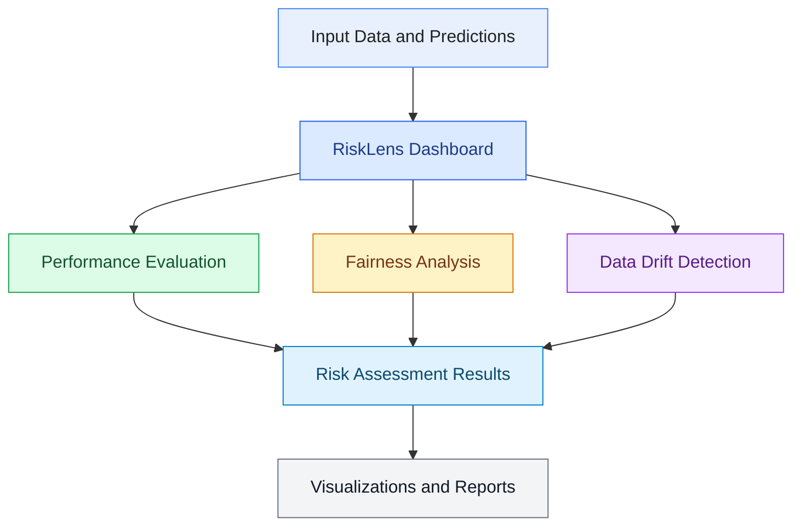

 <div align="center">

# 🛡️ RiskLens
### AI Model Risk Checker

**Evaluate machine learning models for performance, fairness, and data drift — all in one interactive dashboard.**

[](https://www.python.org/)
[](https://streamlit.io/)
[](https://scikit-learn.org/)
[](https://pandas.pydata.org/)
[](LICENSE)

[Overview](#-overview) • [Features](#-key-features) • [Architecture](#-project-structure) • [Installation](#-installation) • [Usage](#-how-to-use) • [Metrics](#-risk-assessment-metrics)

</div>

---

## 📌 Overview

Machine learning models can perform well during development but become unreliable when deployed in real-world environments. Changes in input data, unequal performance across demographic groups, and declining predictive performance can introduce significant model risks.

**RiskLens** is an interactive AI model risk assessment dashboard designed to help users examine these risks through a single interface.

The application brings together model performance evaluation, fairness analysis, and data drift detection to make model behavior easier to inspect and communicate.

### 🎯 Project Objectives

- Evaluate machine learning model performance using relevant metrics.
- Identify potential disparities between demographic groups.
- Detect changes in input data that may indicate data drift.
- Present assessment results through an interactive Streamlit dashboard.
- Generate a consolidated report of model risk assessment findings.

> **Note:** RiskLens is an assessment and monitoring aid. Its metrics do not, by themselves, establish that a model is safe, unbiased, compliant, or suitable for deployment.

---

## ✨ Key Features

<table>
<tr>
<td width="50%">

### 📊 Model Performance

- Evaluate classification performance.
- Inspect supported model evaluation metrics.
- Review results through dashboard visualizations.

</td>
<td width="50%">

### ⚖️ Fairness Analysis

- Examine outcomes across demographic groups.
- Calculate supported fairness metrics.
- Highlight potential differences between groups.

</td>
</tr>
<tr>
<td width="50%">

### 📉 Data Drift Detection

- Compare reference and current datasets.
- Identify potential changes in feature distributions.
- Support investigation of changing data patterns.

</td>
<td width="50%">

### 📄 Risk Reporting

- Consolidate available assessment results.
- Present findings in a readable format.
- Support model review and documentation.

</td>
</tr>
</table>

### 🖥️ Interactive Dashboard

RiskLens uses Streamlit to provide a browser-based interface with a neumorphic visual design, structured metric displays, and data visualizations.

---

## 🏗️ Project Architecture



### 🔄 Assessment Workflow

1. **Provide data:** Load the supported input data and prediction information.
2. **Evaluate performance:** Inspect the available model evaluation metrics.
3. **Assess fairness:** Compare relevant outcomes across groups when the required data is available.
4. **Check drift:** Compare reference data with current data to identify distribution changes.
5. **Review results:** Explore the dashboard and generate the available report.

---

## 📂 Project Structure

```text
RiskLens/
│
├── app.py                    # Main Streamlit application
├── metrics.py                # Model performance evaluation
├── fairness.py               # Fairness assessment
├── drift.py                  # Data drift analysis
├── report.py                 # Assessment reporting
├── sample_data.py            # Sample data utilities
├── example_predictions.csv   # Example prediction data
├── requirements.txt          # Python dependencies
├── README.md                 # Project documentation
│
└── tests/                    # Automated tests
```

---

## 🧰 Technology Stack

| Technology | Purpose |
|---|---|
| Python | Core application logic |
| Streamlit | Interactive web dashboard |
| Pandas | Data processing and manipulation |
| NumPy | Numerical operations |
| Scikit-learn | Machine learning evaluation utilities |
| SciPy | Statistical computations |
| Plotly | Interactive data visualizations |
| Pytest | Automated testing |

---

## ⚙️ Installation

### Prerequisites

- Python 3.9 or a compatible newer version supported by the pinned dependencies.
- Git.
- A terminal or command-line interface.
- Internet access for installing Python packages.

### 1. Clone the Repository

```bash
git clone https://github.com/YOUR_USERNAME/RiskLens.git
cd RiskLens
```

Replace `YOUR_USERNAME` with your GitHub username and `RiskLens` with your actual repository name if different.

### 2. Create a Virtual Environment

**macOS / Linux**

```bash
python3 -m venv .venv
source .venv/bin/activate
```

**Windows**

```powershell
python -m venv .venv
.venv\Scripts\activate
```

### 3. Upgrade pip

```bash
python -m pip install --upgrade pip
```

### 4. Install Dependencies

```bash
python -m pip install -r requirements.txt
```

If dependency installation fails, verify that your Python version is compatible with the package versions pinned in `requirements.txt`.

### 5. Run the Application

```bash
python -m streamlit run app.py
```

Streamlit will display a local URL in the terminal. Open that URL in your browser to access RiskLens.

---

## 🚀 How to Use

1. Launch the application using Streamlit.
2. Explore the available model assessment sections.
3. Provide the required input data or use the example data, where supported.
4. Review the available performance, fairness, and drift results.
5. Inspect the visualizations and report output.

The exact input requirements and available assessment options depend on the implementation in the corresponding Python modules.

---

## 📐 Risk Assessment Metrics

RiskLens organizes model risk assessment into three main areas.

| Assessment Area | What It Examines | Why It Matters |
|---|---|---|
| Model Performance | Predictive performance using supported evaluation metrics | Helps identify weak predictive performance |
| Fairness | Differences in outcomes between relevant groups | Helps investigate potential disparities |
| Data Drift | Changes between reference and current feature distributions | Helps identify changes that may affect model reliability |
| Reporting | Consolidated assessment findings | Makes results easier to review and document |

**Important:** The specific metrics and thresholds depend on the implementation, selected data, and assessment configuration. A detected difference is a signal for investigation, not proof of a problem on its own.

---

## 🧪 Testing

Run the automated test suite from the project root:

```bash
python -m pytest -q
```

To run tests with more detailed output:

```bash
python -m pytest -v
```

Tests should be run in the same virtual environment where the project dependencies are installed.

---

## 🔐 Responsible AI Considerations

RiskLens is intended to support model evaluation and responsible AI practices.

- **Fairness is context-dependent:** A metric alone cannot determine whether a model is fair.
- **Drift is not automatically failure:** Distribution changes require interpretation and may not necessarily reduce model performance.
- **Performance metrics have limitations:** Results depend on data quality, class balance, evaluation design, and the use case.
- **Reports require human review:** Assessment results should be interpreted alongside domain knowledge and relevant organizational policies.
- **Data privacy matters:** Avoid uploading confidential, personal, or sensitive information unless the environment is appropriately secured and authorized.

RiskLens does not replace formal AI governance, independent validation, regulatory review, or human decision-making.

---

## 🛣️ Future Improvements

Potential extensions for the project include:

- [ ] Support additional classification and regression metrics.
- [ ] Add configurable risk thresholds and severity indicators.
- [ ] Expand fairness analysis across multiple protected attributes.
- [ ] Add more statistical drift detection methods.
- [ ] Improve downloadable reports and assessment summaries.
- [ ] Add historical model assessment tracking.
- [ ] Introduce automated testing for edge cases and invalid inputs.
- [ ] Deploy a public demo with appropriate sample data and security controls.

These are potential enhancements and are not claims about features already implemented.

---

## 🤝 Contributing

Contributions, bug reports, and suggestions are welcome.

1. Fork the repository.
2. Create a feature branch.
3. Make your changes and add relevant tests.
4. Run the test suite.
5. Open a pull request describing your changes.

For substantial changes, consider opening an issue first to discuss the proposed improvement.

---

## 👨‍💻 Author

**Harsh Sharma**

Integrated M.Tech in Computer Science — Computational and Data Science

- GitHub: [@harsh1223-bit](https://github.com/harsh1223-bit)

---

<div align="center">

**Built to make machine learning risks easier to inspect, understand, and communicate.**

⭐ If you find RiskLens useful, consider starring the repository!

</div>